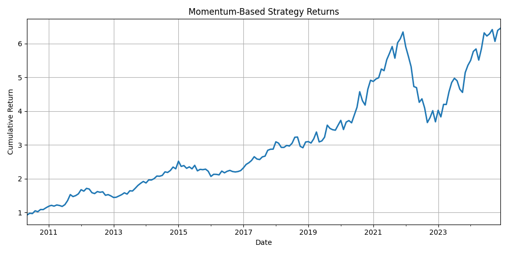
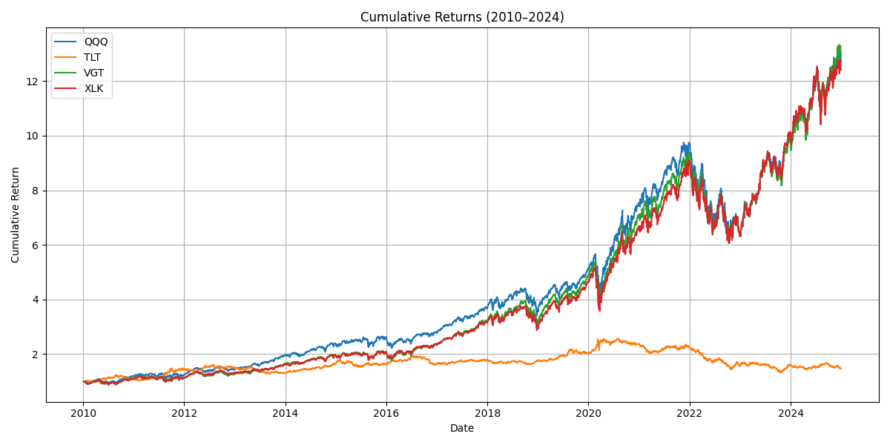
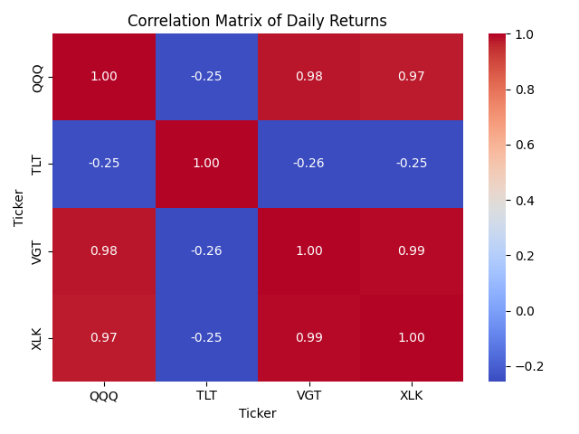

# Week 10 Term Project: Momentum-Based Trading Strategy

## Overview
This project implements a **momentum-based trading strategy** using historical ETF price data from **2010 to 2024**. We apply a rules-based algorithmic trading approach combining moving averages, momentum ranking, and monthly rebalancing to simulate realistic trading behavior.

The strategy focuses on tech ETFs with the potential addition of a bond ETF to reduce correlation and improve diversification.

---

## General Investment Philosophy
The core investment philosophy follows a **systematic momentum strategy**:

- **Buy high, sell higher**: Assets with strong recent performance (momentum) are likely to continue outperforming.
- **Use trend indicators**: 50-day and 200-day SMAs help identify bullish trends.
- **Diversification**: Including bond ETFs (e.g., TLT) mitigates risk.
- **Monthly rebalancing**: Aligns the portfolio with strongest-performing assets.

---

## Investment Methods & Trading Rules

### Signal Generation
- **Momentum Indicator**: 20-day price change (%)
- **Trend Filter**: Asset must pass 50-day and 200-day SMA filter
- **Ranking**: Each month, assets are ranked by momentum
- **Selection**: Top 2 momentum assets are chosen

### Portfolio Allocation
- **Equal weighting**: 50% each to top 2 assets
- **Rebalancing**: Monthly rebalancing using new momentum & SMA signals

---

## Portfolio Composition & Trading Summary

### Initial ETF Universe
- `QQQ` – Invesco QQQ Trust (Nasdaq 100)
- `VGT` – Vanguard Information Technology ETF
- `XLK` – Technology Select Sector SPDR Fund
- `TLT` – iShares 20+ Year Treasury Bond ETF (added for diversification)

### Key Observations
- Tech ETFs (`QQQ`, `VGT`, `XLK`) have **very high correlation** (≥ 0.97)
- `TLT` shows **negative correlation** (~ -0.25), offering risk diversification

### Monthly Trading Summary
- Strategy avoids assets that fail SMA criteria
- Momentum rankings change monthly based on market trends

---

## Performance Evaluation (2010–2024)

| Metric | Value |
|--------|-------|
| Total Return | **545.5%** |
| Annualized Return | **15.0%** |
| Annualized Volatility | **16.3%** |
| Sharpe Ratio | **0.92** |
| Max Drawdown | **-42.3%** |

---

## Performance Charts
- `strategy_returns.png`: Cumulative return of the strategy
  
- `cumulative_returns.png`: Individual ETF cumulative returns
  
- `correlation_matrix.png`: Asset correlation heatmap
- 

---

## Management Recommendation

> **Would I start a fund around this strategy?** Yes.  
The model is systematic, transparent, and performs well across different regimes.

### Preferred Role:
**Quantitative Researcher** — to extend the model with:
- Macroeconomic signals
- Volatility targeting
- Adaptive rebalancing

### Investor Sentiment:
This strategy presents a compelling case for long-term investors seeking **data-driven growth exposure**. Personally, I would invest and recommend it as a rules-based growth ETF strategy.

---

## Repository Structure
```
root/
│
├── Data Files
│ ├── price_data.csv
│ ├── sma_50.csv
│ ├── sma_200.csv
│ ├── momentum_20d.csv
│ ├── strategy_returns.csv
│ ├── strategy_cumulative_returns.csv
│ ├── strategy_performance_metrics.csv
│ └── correlation_matrix.csv
│
├── Visualizations
│ ├── cumulative_returns.png
│ ├── strategy_returns.png
│ └── correlation_matrix.png
│
├── Notebook
│ └── Week10.ipynb
│
├── Report
│ └── W10_Term_Report.pdf
```

---

## How to Reproduce

1. **Clone the repository**  
2. **Install dependencies**  
```bash
pip install pandas numpy matplotlib yfinance seaborn
```

3.**Run the notebook**
```bash
jupyter notebook Week10.ipynb
```
All intermediate .csv outputs and .png plots will be generated and saved, unless already present.

---

## Future Improvements

- Add volatility-adjusted momentum (e.g., Sharpe/MAR ranking)
- Add bull/bear regime switching filters
- Apply adaptive position sizing (e.g., inverse volatility weights)
- Test transaction cost sensitivity and slippage
- Expand ETF universe to include:
  - International equity ETFs
  - Small-cap and sector rotation themes


